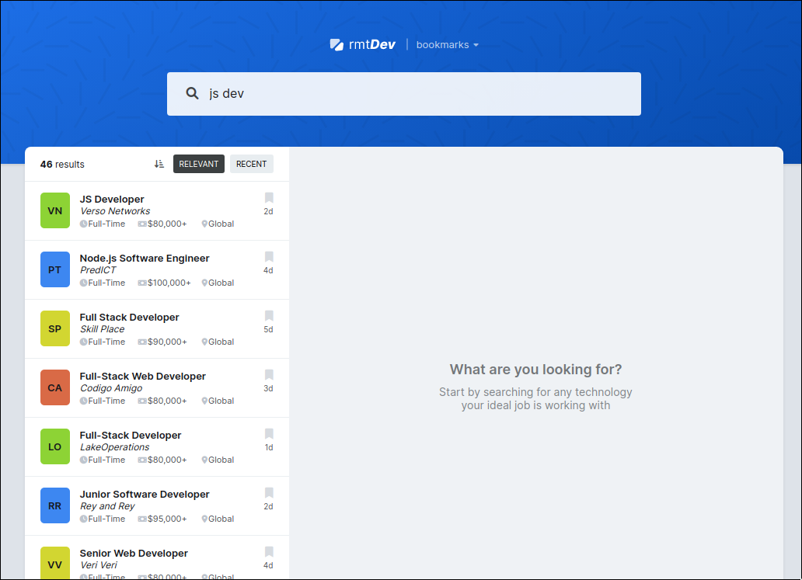

# REMOTEDEV - Remote developer Job Search

<!--toc:start-->

- [REMOTEDEV - Remote developer Job Search](#remotedev-remote-developer-job-search)
  - [Getting Started](#getting-started)
    - [`npm i`](#npm-i)
  - [Available Scripts](#available-scripts) - [`npm exec live-server`](#npm-exec-live-server)
  <!--toc:end-->

This is a basic job search web app with Javascript, html & css as a learning project.

## Getting Started

In the project directory run

### `npm i`

## Available Scripts

In the project directory, you can run:

### `npm exec live-server`

Runs the app in the development mode.\
Open `http://localhost:8080` to view it in your browser.

The page will reload when you make changes.\
You may also see any lint errors in the console.
